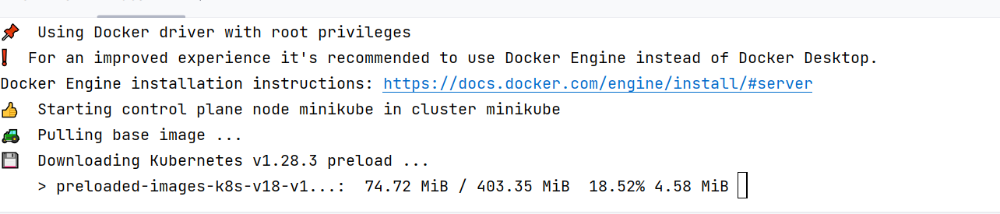
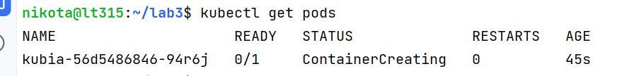
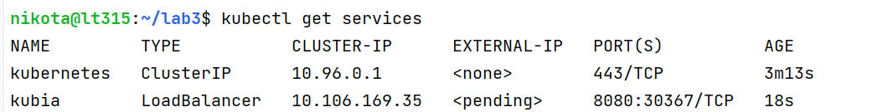
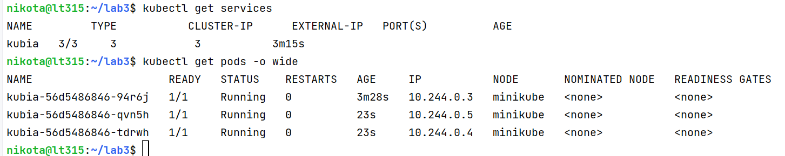
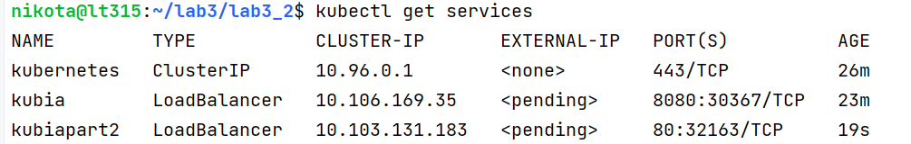
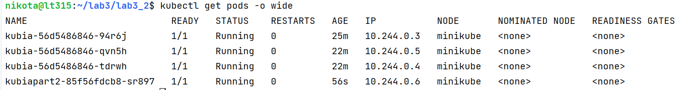
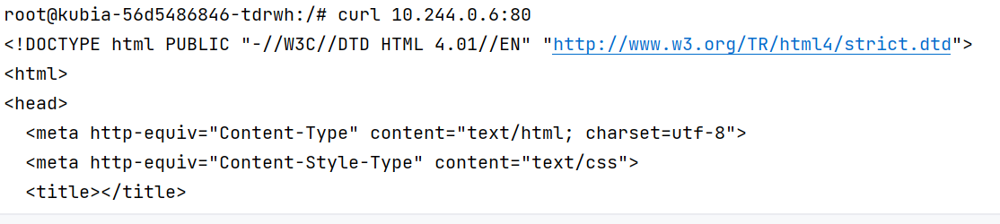

Задание 1

1) Собираем докер образ и пушим его
https://hub.docker.com/repository/docker/svjashennik/lab3_1
2) minikube start

3) kubectl create deployment kubia --image=svjashennik/lab3_1

4) kubectl expose deployment kubia --type=LoadBalancer --port=8080

5) kubectl scale deployment kubia --replicas=3

6) curl -s 10.103.217.134:8080

Задание 2

1) Собираем образ докер и пушим его

https://hub.docker.com/repository/docker/svjashennik/lab3_2

2) kubectl create deployment kubiapart2 --image=svjashennik/lab3_2:latest

